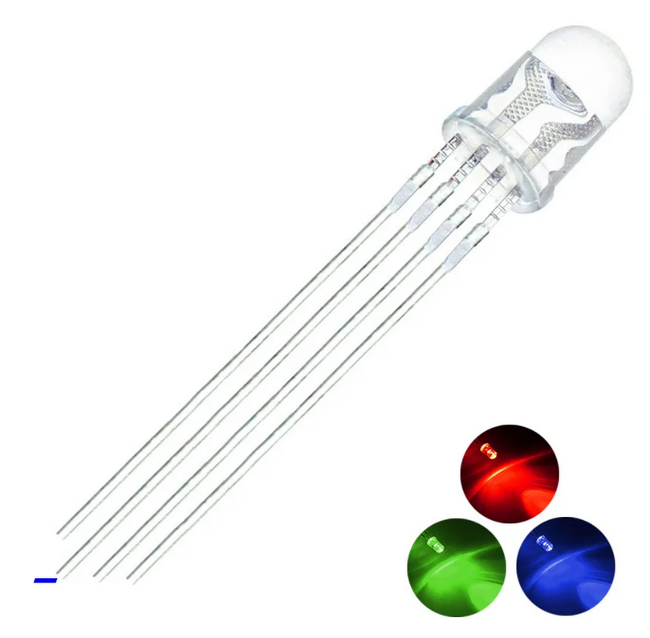
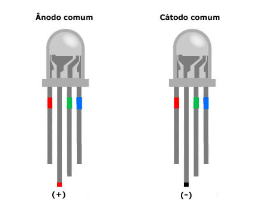
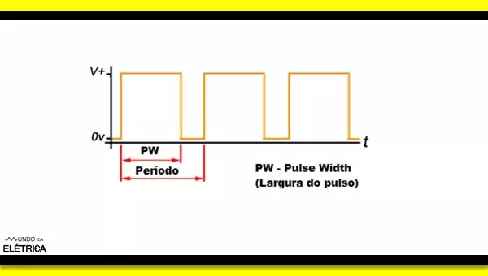
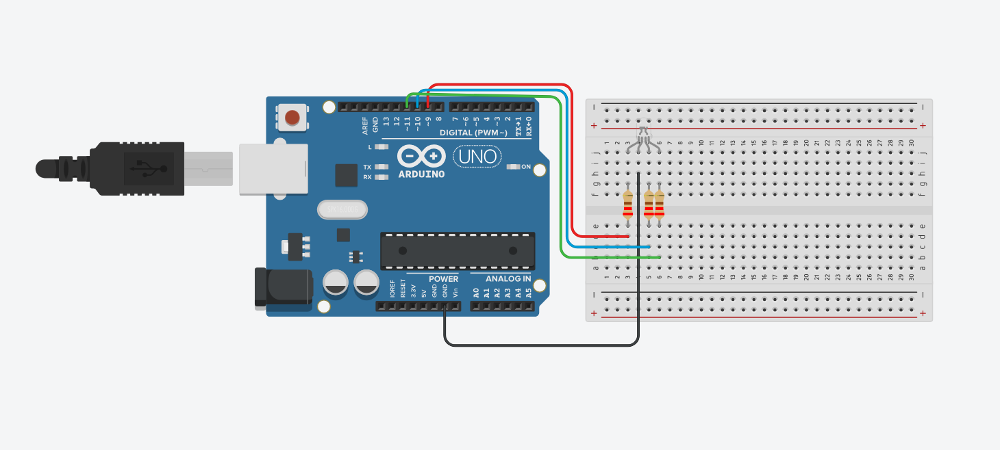

# Led RGB 

Você sabe o que é um LED RGB (Light Emitting Diode)? Diferente do LED convencional, o LED RGB funciona a partir da junção de três LEDs (nas cores vermelho, verde e azul) dentro de um único componente. Como cada um deles funciona individualmente, sua combinação permite a formação de novas cores, tornando-o muito mais adequado para projetos que demandam uma visualização dinâmica e iluminação personalizada.


Dessa forma, é possível fazer uma combinação de 7 cores básicas intercalando os estados HIGH e LOW nas entradas. Já utilizando o sinal PWM, você obtém uma variedade muito maior de cores. Isso acontece porque o PWM permite variar a intensidade de cada LED em uma escala de 0 a 255, gerando inúmeras combinações a partir das três cores primárias. 

<div align="center">
<h3>Figura 1 - Led RGB<h3/>



<p>Fonte: https://www.squids.com.br/arduino/software/dicas-de-software/372-led-rgb-anodo-comum-ou-o-led-rgb-catodo-comum-como-identificar-e-usar-com-arduino-cirucito-e-programacao<p>
</div>

Existem dois tipos desse LED: o ânodo comum e o cátodo comum. Essa diferenciação é feita a partir das ligações internas dos LEDs, que podem compartilhar o ânodo (5V) ou o cátodo (GND) entre eles. Isso modifica a lógica de funcionamento do componente, no cátodo comum, ele funciona da forma que já conhecemos, ou seja, o LED acende com o sinal HIGH. Já no ânodo comum, a lógica é invertida, para o LED ser aceso, é necessário enviar um sinal LOW.

<div align="center">
<h3>Figura 2 - Ânodo e cátodo comum <h3/>


<p>Fonte: https://www.squids.com.br/arduino/software/dicas-de-software/372-led-rgb-anodo-comum-ou-o-led-rgb-catodo-comum-como-identificar-e-usar-com-arduino-cirucito-e-programacao<p>
</div>

<h2>O que é PWM?<h2/>

Agora que já sabemos como o PWM(Pulse Width Modulation ) auxilia no funcionamento do LED RGB, você sabe como ele funciona?
O PWM funciona controlando a tensão média que vai para o LED, e esse cálculo é definido pela variação da largura dos pulsos de um sinal elétrico. Quando temos um sinal sendo recebido, chamamos isso de largura de pulso, quanto maior ela for, mais tensão chega aos LEDs. Dividindo essa largura pelo período (que é o tempo total de uma onda), conseguimos calcular o ciclo de trabalho. Veja a fórmula abaixo:

D = (PW / T) x 100%

Onde D representa o ciclo de trabalho, sendo a porcentagem de tempo em que o sinal fica ligado, PW é a largura do pulso e T é o período total da onda. Por exemplo, se aplicarmos uma tensão de 5V com um D de 80%, temos o sinal representado na figura abaixo resultando em 4V de tensão: 

<div align="center">
<h3>Figura 3 - Gráfico de onda <h3/>


<p>Fonte: https://www.mundodaeletrica.com.br/pwm-o-que-e-para-que-serve/<p>
</div>

<h2> Materiais Necessários <h2/>

- 1 Led RGB
- 1 Arduino UNO
-  resistores 220 ohm
- 4 jumpers 
- 1 Protoboard

<h2>Circuito<h2/>

Neste circuito, iremos demonstrar a utilização do LED RGB e gerar diferentes cores utilizando o PWM. 

<div align="center">
<h3>Figura 4 - Circuito Tinkercad <h3/>


<p>Fonte: Autoria própria <p>
</div>

Para montar o circuito, iremos conectar os pinos vermelho, verde e azul nas portas 9, 10 e 11 do Arduino, utilizando resistores de 220Ω  em cada uma delas, e conectando o cátodo comum ao GND do Arduino.
A escolha dessas portas é importante para o funcionamento do projeto, podendo ser trocadas apenas por outras que tenham um til(~) ao lado do número, visto que estas são as únicas portas digitais do Arduino Uno que suportam o sinal PWM. Isso ocorre porque as demais portas funcionam apenas com os estados ligado (5V) e desligado (0V), não conseguindo controlar de forma gradual a intensidade luminosa do LED. 

<h2>Código<h2/>

Para começarmos nosso código, iremos definir os pinos do nosso circuito utilizando o #define. Ele cria constantes para cada uma das cores: 
```cpp
#define vermelho 9
#define azul 10
#define verde 11
```

A seguir, iremos configurar os pinos que representam as constantes como saídas (OUTPUT) dentro da função setup(), utilizando o comando pinMode():
 ```cpp
void setup(){
   pinMode(vermelho, OUTPUT);
   pinMode(verde, OUTPUT);
   pinMode(azul, OUTPUT);
}
```

Agora, com tudo configurado, iremos criar as funções de cada uma das cores primárias. Para demonstrar o funcionamento do PWM variando a intensidade do LED pelo comando analogWrite( ), que trabalha em uma escala de 0 a 255, que representa a porcentagem real de 0% a 100% do ciclo de trabalho aplicada ao componente, também faremos uma função com dois tipos de roxo: 
```cpp
void red(){
  analogWrite(azul, 0);
  analogWrite(verde, 0);
  analogWrite(vermelho, 255);
}
void green(){
  analogWrite(azul, 0);
  analogWrite(verde, 255);
  analogWrite(vermelho, 0);
}
void blue(){
  analogWrite(azul, 255);
  analogWrite(verde, 0);
  analogWrite(vermelho, 0);
}
void roxo(){
  analogWrite(azul, 255);
  analogWrite(verde, 0);
  analogWrite(vermelho, 255);
  delay(700);
  analogWrite(azul, 10);
  analogWrite(verde, 0);
  analogWrite(vermelho, 200);
}
```
Para finalizarmos nosso projeto, iremos colocar essas funções dentro do loop() para demonstrar a transição das cores repetidamente: 
```cpp
void loop(){ 
  red();
  delay(700);
  green();
  delay(700);
  blue();
  delay(700);
  roxo();
  delay(700);
}
```

